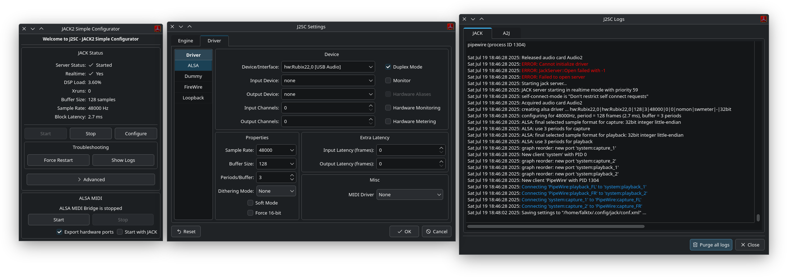

# JACK 2 Simple Configurator

J2SC stands for JACK 2 Simple Configurator and is, as the name says, a configuration tool for JACK2.

## Project Goals

J2SC is mean to be a configuration tool for JACK2, working through the jackdbus interface.  
Compatibility with other JACK versions (or PipeWire) is possible but will be accidental, focus is on JACK2.

Linux is the mainly supported OS, it might work on other systems like BSD but on those "you are on your own".
There is also no support whatsoever for macOS, Windows, or any other platform where a DBus is not a core system feature.

Also there is no support for network related JACK backends, as the author has no use for them.

### TODO

A rough list of items planned for implementation in future releases:

 - JACK "max dsp load" information (needs changes on JACK2 side first)
 - JACK "session file", similar to `jackd -C <file>`
 - Find ways to give estimate "full roundtrip latency" => buffer-size * (n-periods + async-on) + hw-latency
 - Use a2jmidid hw-export DBus call instead of local application setting

### Unwanted features

Stuff that is not coming to J2SC for sure:

 - Perform system audio checks
 - PipeWire specific features
 - Systray (was present on Cadence but didn't work well)

## Relation to Cadence

J2SC is based on the old Cadence also from me (falkTX), but with everything removed except the JACK configuration part.
I abandoned the Cadence as it was not up to my own standards, it was one of the very first projects I started as a way to learn GUI programming.

Over time Cadence small parts have moved into other projects:

 - patchbay canvas code was integrated in [Carla](https://kx.studio/Applications:Carla), where it received many updates
 - [Carla](https://kx.studio/Applications:Carla)'s canvas was branched off into [RaySession](https://github.com/Houston4444/RaySession), which uses the same code as base but with its own style (external project, not my own)
 - [pyjacklib](https://github.com/jackaudio/pyjacklib) became its own project (external project I am helping maintain)
 - [qjackcapture](https://github.com/SpotlightKid/qjackcapture) from the jack render tool (another external project)
 - bigmeter and xycontrollers were added as internal plugins in [Carla](https://kx.studio/Applications:Carla)
 - [WineASIO](https://github.com/wineasio/wineasio/) settings panel

The only big remaining part to still be split off was the jack2/jackdbus settings tool.  
Even if the code is not the best, I find this particular tool to be quite useful, so I continue it through the J2SC project.
